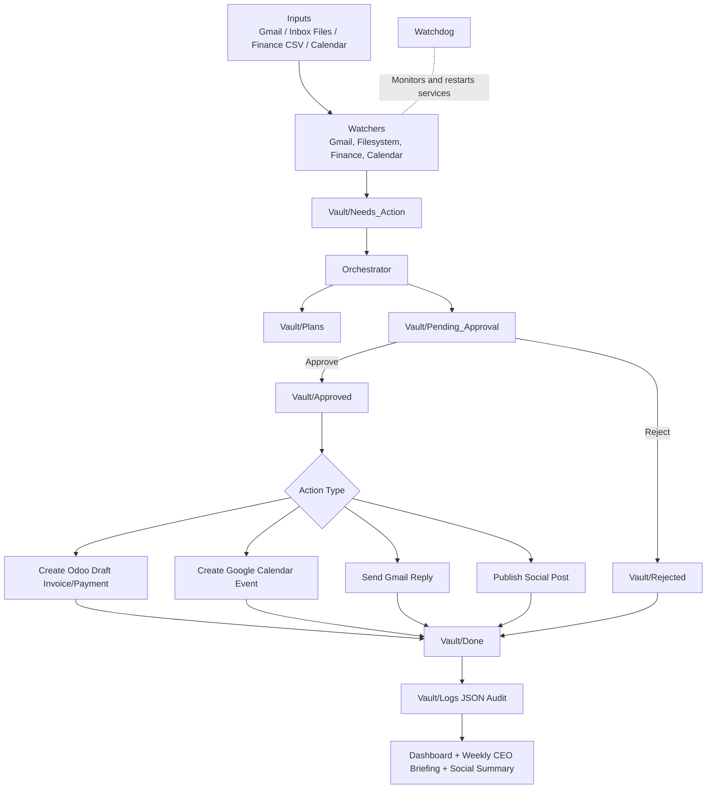

# Personal AI Employee

Gold-tier build with multi-channel social drafting, expanded Odoo draft accounting MCP, weekly CEO briefing generation, and Ralph-loop persistence.

## Architecture

- **Perception:** Gmail, File System, Finance CSV, and Calendar watchers
- **Reasoning:** Orchestrator creates plans and approval files
- **Action:** Human-in-the-loop via `Pending_Approval` → `Approved`/`Rejected`, Gmail Send MCP, LinkedIn/Facebook/Instagram/X publish on approval, Odoo draft invoice/payment actions
- **Resilience:** Watchdog monitors and restarts key services
- **Executive Layer:** Weekly CEO briefing generation + social posting summaries

## Program Flow Chart



## Prerequisites

- Linux/macOS shell
- Python 3.11+
- Optional: Gmail/Calendar OAuth credentials
- Optional: Local Odoo 19 instance

## Setup

1. Create and activate Python environment.
   ```bash
   python3 -m venv .venv
   source .venv/bin/activate
   ```
2. Install dependencies:
   ```bash
   pip install -r requirements.txt
   ```
3. Configure `.env` values (vault path, API tokens, Odoo/Google settings).

## Run with Docker

Build image:

```bash
docker build -t personal-ai-employee .
```

Run container (mount Vault for persistent data and load `.env`):

```bash
docker run --name personal-ai-employee \
   --env-file .env \
   -e VAULT_PATH=/app/Vault \
   -v "$(pwd)/Vault:/app/Vault" \
   personal-ai-employee
```

This container starts the MVP stack (`filesystem_watcher` + `orchestrator`).

Stop container:

```bash
docker stop personal-ai-employee
```

## Quick Start (MVP)

Start only the minimum required stack:

1. Start filesystem watcher:
   ```bash
   bash .agents/skills/filesystem-watcher/scripts/start.sh
   ```
2. Start orchestrator:
   ```bash
   bash .agents/skills/orchestrator/scripts/start.sh
   ```
3. Drop any file into `Vault/Inbox`.
4. Check outputs in `Vault/Needs_Action`, `Vault/Plans`, and `Vault/Done`.

## Run Full Stack

Start all Gold-tier services:

```bash
bash .agents/skills/orchestrator/scripts/start_all.sh
```

Stop all Gold-tier services:

```bash
bash .agents/skills/orchestrator/scripts/stop_all.sh
```

Use watchdog directly:

```bash
bash .agents/skills/watchdog/scripts/start.sh
bash .agents/skills/watchdog/scripts/status.sh
```

Stop all known services:

```bash
bash .agents/skills/watchdog/scripts/stop-all.sh
```

## Run Individual Services

```bash
bash .agents/skills/gmail-watcher/scripts/start.sh
bash .agents/skills/filesystem-watcher/scripts/start.sh
bash .agents/skills/finance-watcher/scripts/start.sh
bash .agents/skills/calendar-watcher/scripts/start.sh
bash .agents/skills/orchestrator/scripts/start.sh
```

## OAuth Setup (One-Time)

For Gmail:

```bash
.venv/bin/python .agents/skills/gmail-watcher/scripts/gmail_oauth_setup.py
```

Note: Gmail OAuth now requests both `gmail.modify` and `gmail.send` scopes.

For LinkedIn posting:

```bash
.venv/bin/python .agents/skills/linkedin-poster/scripts/linkedin_oauth_setup.py
```

For Google Calendar:

```bash
.venv/bin/python .agents/skills/calendar-watcher/scripts/calendar_oauth_setup.py
```

## Odoo Integration (Odoo 19+ JSON-RPC)

Start local self-hosted Odoo Community + PostgreSQL:

```bash
bash .agents/skills/odoo-integration/scripts/start-local-odoo.sh
```

Open `http://localhost:8069` and create your business database on first run.

Start Odoo MCP-style server:

```bash
bash .agents/skills/odoo-integration/scripts/start-server.sh
```

Verify Odoo connection:

```bash
.venv/bin/python .agents/skills/odoo-integration/scripts/verify.py
```

Supported Odoo MCP methods:
- `odoo_health_check`
- `odoo_accounting_readiness`
- `odoo_list_journals`
- `odoo_list_accounts`
- `odoo_ensure_partner`
- `odoo_list_partners`
- `odoo_list_draft_invoices`
- `odoo_create_draft_invoice` (draft-only)
- `odoo_create_draft_payment` (draft-only)

Bootstrap accounting readiness and optional partner seed:

```bash
.venv/bin/python .agents/skills/odoo-integration/scripts/bootstrap_accounting.py \
   --ensure-partner-name "Acme LLC" \
   --ensure-partner-email "finance@acme.local"
```

Stop local Odoo stack:

```bash
bash .agents/skills/odoo-integration/scripts/stop-local-odoo.sh
```

## Gold Tier Skills

- `.agents/skills/social-poster/` (Facebook/Instagram/X draft → approve → publish)
- `.agents/skills/ceo-briefing/` (weekly Monday briefing generation)
- `.agents/skills/ralph-loop/` (persistence loop utility)

## Folder Flow

- `Vault/Inbox` → file drops
- `Vault/Needs_Action` → incoming tasks
- `Vault/Plans` → generated plans
- `Vault/Pending_Approval` → requires human action
- `Vault/Approved` / `Vault/Rejected` → human decisions
- `Vault/Done` → archived processed files
- `Vault/Logs` → JSON audit logs

## Troubleshooting

- Check logs:
  - `/tmp/filesystem-watcher.log`
  - `/tmp/orchestrator.log`
  - `/tmp/watchdog.log`
- If service stuck, stop and restart:
  ```bash
   bash .agents/skills/orchestrator/scripts/stop_all.sh
   bash .agents/skills/orchestrator/scripts/start_all.sh
  ```

## Scheduling (cron)

Install reboot + health-check cron jobs:

```bash
bash .agents/skills/orchestrator/scripts/install_cron.sh
```

LinkedIn draft scheduling file:

- `Vault/Schedules/linkedin_post.md`
- `Vault/Schedules/facebook_post.md`
- `Vault/Schedules/instagram_post.md`
- `Vault/Schedules/twitter_post.md`
- `Vault/Schedules/weekly_ceo_briefing.md`

## Ralph Loop

Run a persistent loop until completion file exists:

```bash
python3 .agents/skills/ralph-loop/scripts/ralph_loop.py \
   --command "python3 .agents/skills/orchestrator/scripts/orchestrator.py" \
   --done-file "Vault/Done/TASK_COMPLETE.md" \
   --max-iterations 10
```

## Vault Path

`/home/abdul-matten/Desktop/Personal-AI-Employee /Vault`
